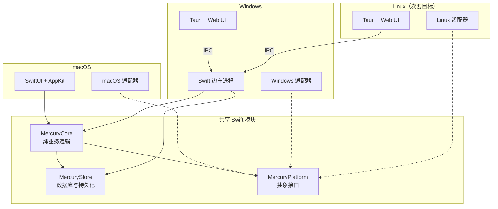

# Mercury 跨平台分析 & 移植计划

> 生成日期：2026-07-12

## 1. 项目概览

Mercury 是一款 **macOS 原生、本地优先的 RSS 阅读器**，专注于舒适的信息聚合与阅读体验，并配备高度可定制的 AI 功能。

### 1.1 核心技术栈

| 层级 | 技术 |
|---|---|
| 语言 | Swift（Swift 6 并发） |
| UI | SwiftUI + AppKit（混合） |
| 存储 | SQLite（通过 GRDB，WAL 模式） |
| 网络 | URLSession |
| Feed 解析 | FeedKit |
| HTML 清理 | SwiftSoup |
| 文章提取 | 自研 `Readability`（无 WebKit 依赖） |
| Markdown → HTML | swift-markdown + 内置 `MarkupHTMLVisitor`（支持 GFM） |
| LLM 客户端 | SwiftOpenAI |
| 测试 | Swift Testing（`@Suite`、`@Test`、`#expect`） |

### 1.2 模块架构

```
Mercury/Mercury/
├── App/            # 入口点、根组合、应用生命周期
├── Agent/          # AI 智能体基础设施
│   ├── Provider/   # LLM 提供商管理与验证
│   ├── Runtime/    # 状态机、引擎、存储、激活
│   ├── Summary/    # 文章摘要
│   ├── Translation/# 段落级双语翻译
│   ├── Tagging/    # AI 标签建议
│   ├── Settings/   # 智能体配置
│   └── Shared/     # 共享智能体工具
├── Core/
│   ├── Database/   # GRDB 模型、迁移、存储、查询构建器
│   ├── Tasking/    # TaskQueue、TaskCenter
│   └── Shared/     # 共享工具
├── Reader/         # 文章提取、Markdown 转换、主题
├── Feed/           # 订阅源管理、同步、OPML 导入导出
├── Digest/         # 笔记、文摘分享与导出
├── Tags/           # 标签规范化、本地标签、批量策略
├── Usage/          # LLM token 用量追踪与报表
└── Resources/      # 智能体提示词、文摘模板
```

### 1.3 核心功能模块

| 模块 | 说明 |
|---|---|
| **Feed** | RSS/Atom/JSON Feed 解析、OPML 导入导出、订阅源同步、侧边栏计数 |
| **Reader** | 自研 `Readability` 提取、Markdown 转换、主题/字体定制、阅读管线 |
| **Agent - Summary** | 可配置语言与详细程度的文章摘要、流式输出、自定义提示词 |
| **Agent - Translation** | 段落级双语对照布局、逐段并发、重试/恢复/清除、HY-MT2 优化 |
| **Agent - Tagging** | AI 标签建议、批量打标签、标签库维护（合并/别名/清理） |
| **Digest** | 单篇 Markdown 笔记、单篇/多篇文摘导出、通过 macOS 服务分享 |
| **Usage** | Token 用量统计与对比报表（Provider/Model/Agent 维度） |
| **Settings** | Provider/Model/Agent 配置、提示词定制、文摘模板定制 |

---

## 2. 当前平台约束

### 2.1 macOS 专属依赖

以下 API 与 macOS 深度耦合，跨平台支持需要对其进行抽象：

| API / 框架 | 用途 | 移植策略 |
|---|---|---|
| SwiftUI | 所有 UI | 用 Tauri + Web UI 重写 |
| AppKit（`NSOpenPanel`、`NSSavePanel`） | 文件对话框 | 平台适配器 |
| `WKWebView` | 阅读器内容渲染 | Windows 上使用 WebView2 |
| `NSPasteboard` | 剪贴板 | 平台适配器 |
| `NSSharingServicePicker` | 分享面板 | 平台适配器 / 移除 |
| `SecurityScopedBookmark` | 导出目录访问 | 平台适配器 |
| `NSSpellChecker` | 拼写检查 | 平台适配器 / 移除 |
| `CoreText` | 字体枚举 | 平台适配器 |
| `AppIntents` | Siri/快捷指令集成 | 仅 macOS / 移除 |
| Sparkle | 自动更新 | 平台特定替代方案 |
| Keychain | 凭证存储 | 平台适配器 |
| `UserDefaults`（沙盒） | 设置存储 | 平台适配器 |
| macOS Bundles | 本地化资源 | 平台适配器 |
| `Charts`（Swift Charts） | 用量报表 | Web 图表库 |

### 2.2 各模块跨平台可行性

| 模块 | 复用潜力 | 策略 |
|---|---|---|
| `Readability` | **高** — 独立 Swift 包 | Swift 可在 Windows 编译则直接复用 |
| `ReaderDefaultPipeline` | **高** — 纯逻辑 | 提取到 MercuryCore |
| `MarkdownConverter` / `MarkupHTMLVisitor` | **高** — 纯逻辑 | 提取到 MercuryCore |
| 数据库层（GRDB + 模型 + 迁移） | **高** — GRDB 跨平台 | 提取到 MercuryStore |
| Feed 同步 / 用例 | **高** — 大部分为纯逻辑 | 提取到 MercuryCore |
| Agent 运行时 / 状态机 | **高** — 纯逻辑 | 提取到 MercuryCore |
| 提示词解析 / 模板 | **高** — 纯逻辑 | 提取到 MercuryCore |
| Summary / Translation / Tagging 合约 | **高** — 纯逻辑 | 提取到 MercuryCore |
| 标签规范化 / 本地标签 | **高** — 纯逻辑 | 提取到 MercuryCore |
| Digest 组合 / 导出策略 | **高** — 纯逻辑 | 提取到 MercuryCore |
| Usage 报表合约 | **高** — 纯逻辑 | 提取到 MercuryCore |
| OPML 导入导出 | **高** — 大部分为纯逻辑 | 提取到 MercuryCore |
| SwiftUI 视图 | **无** — 仅 macOS | 用 Web UI 重写 |
| AppKit representable | **无** — 仅 macOS | 用平台适配器重写 |
| `WKWebView` 包装器 | **无** — 仅 macOS | 替换为 WebView2 |
| Keychain / 安全 | **无** — 仅 macOS | 平台适配器 |
| Sparkle 更新 | **无** — 仅 macOS | 平台特定替代方案 |

---

## 3. 目标架构

### 3.1 三层分离



### 3.2 各层职责

#### MercuryCore（纯业务逻辑）

- Feed 用例与同步策略
- Reader 管线合约
- Markdown 转换策略
- Agent 运行时与状态机
- 提示词/模板解析
- Summary、Translation、Tagging 合约
- Digest 组合/导出策略
- 任务生命周期逻辑
- Usage 报表合约
- 标签规范化与本地标签回退

#### MercuryStore（持久化层）

- `DatabaseManager`
- Schema 迁移
- GRDB 模型
- Feed、Entry、Content、Tag、Note、Agent、Translation、Summary、Digest、Usage 存储
- 查询构建器
- 数据库相关测试

#### MercuryPlatform（抽象接口）

- 凭证存储
- 设置存储
- 文件选择器与导出目录访问
- 剪贴板
- 分享服务
- 字体目录
- 拼写检查辅助
- WebView 托管
- 通知
- 自动更新
- 操作系统特定路径与权限
- 本地化资源加载

---

## 4. 移植任务

### 阶段 0：可行性验证（决策关口）

> **目标**：回答"Mercury 的 Readability 和数据库层能否在 Windows 上可靠运行？"
> **产出**：Go / No-Go 决策。

| # | 任务 | 详情 |
|---|---|---|
| 0.1 | **选择 Windows Swift 工具链** | 评估 swift.org 官方工具链与社区发行版（如 The Browser Company 的 Swift 6 for Windows）。记录确切版本与安装方法。 |
| 0.2 | **验证 Swift 6 并发运行时** | 在 Windows 上编译并**运行**一个 async/await、actor、Task、Sendable 的小程序。仅编译检查不够。 |
| 0.3 | **验证 Swift Testing 可用性** | 检查 Swift Testing（`@Suite`、`@Test`、`#expect`）是否在所选 Windows 工具链上可用。如不可用则回退到 XCTest。 |
| 0.4 | **解决 SQLite 链接问题** | Windows 无系统 SQLite。选项：SPM 静态编译、预编译 amalgamation 或 vcpkg。必须支持 WAL 日志模式（Mercury 所需）。 |
| 0.5 | **审计 Readability 中的 Darwin API** | 扫描 `Darwin.C`、平台条件编译、OSLog 使用。将每一项分类为阻断或可修补。 |
| 0.6 | **构建 `MercuryPortingProbe`** | 独立 SwiftPM 包，包含：Readability + SwiftSoup + GRDB + 最小 Mercury schema/迁移 + Content 模型 + ContentStore。 |
| 0.7 | **探针验证测试** | 至少 3-5 个 HTML fixture（标准博客、中文/UTF-8 编码、嵌套表格、畸形标记、混合内容）。验证：Readability 提取 → HTML 清理 → Markdown 转换 → GRDB 增删改查 → 数据库重开。 |

### 阶段 1：核心模块提取与平台抽象

> **目标**：在不破坏 macOS 应用的前提下，将可复用代码与 macOS 专属代码分离。

| # | 任务 | 详情 |
|---|---|---|
| 1.1 | **创建 `MercuryCore` 模块** | 提取纯业务逻辑。无 AppKit/UIKit/SwiftUI 导入。无 Darwin 专属 Foundation API。 |
| 1.2 | **创建 `MercuryStore` 模块** | 提取数据库层。GRDB 模型、迁移、所有存储、查询构建器。零 UI 导入。 |
| 1.3 | **定义 `MercuryPlatform` 协议** | 为所有平台依赖能力设计抽象接口（见 3.2 节）。 |
| 1.4 | **实现 macOS 适配器** | 将现有 AppKit/SwiftUI 代码接入 `MercuryPlatform` 协议。 |
| 1.5 | **移除 Core/Store 中的平台导入** | 确保 `MercuryCore` 和 `MercuryStore` 编译时不带 `import AppKit` 或 `import SwiftUI`。 |
| 1.6 | **解耦本地化基础设施** | 使 `LanguageManager` 脱离 macOS Bundle 体系运行。支持从替代路径加载 `.strings`/`.xcstrings` 资源。 |
| 1.7 | **验证 macOS 应用仍可构建运行** | 提取后运行完整的 `./scripts/build && ./scripts/test`。零回归。 |

### 阶段 2：Windows UI 框架

> **目标**：用所选框架（推荐 Tauri + Web UI）构建 Windows UI 壳。

| # | 任务 | 详情 |
|---|---|---|
| 2.1 | **初始化 Tauri v2 项目** | 配置 Tauri 与 WebView2（Windows 10+ 原生支持），搭建项目结构。 |
| 2.2 | **设计 IPC 协议** | 定义 JSON-RPC 或 stdin/stdout/命名管道命令规范。仅限粗粒度命令（不暴露原始存储 API）。 |
| 2.3 | **实现 Swift 边车进程** | 将 `MercuryCore` + `MercuryStore` 编译为 Windows 可执行文件。通过 IPC 暴露命令。单个进程持有数据库。 |
| 2.4 | **实现 Windows 平台适配器** | 文件对话框（Win32）、剪贴板（Win32）、通知（Windows Toast）、凭证存储（Credential Manager）、路径管理、设置存储。 |
| 2.5 | **构建 Web UI 壳** | 选择前端框架（React/Vue/Svelte）。实现：侧边栏布局、订阅源列表、文章列表、阅读区、工具栏。 |
| 2.6 | **阅读器内容渲染** | 在 WebView 中渲染清理后的 HTML/Markdown。支持主题切换、字体定制、图片/表格/列表展示。 |
| 2.7 | **Agent 面板 UI** | 摘要面板（流式输出）、双语翻译布局、标签面板，全部使用 Web UI。 |

### 阶段 3：功能迁移

> **目标**：达到与 macOS 版本的功能对等。

| # | 任务 | 详情 |
|---|---|---|
| 3.1 | **订阅源管理** | 添加/删除/刷新订阅源、OPML 导入导出、订阅源分组。 |
| 3.2 | **文章列表与筛选** | 文章列表含已读/未读状态、搜索（标题+摘要）、按标签筛选。 |
| 3.3 | **阅读器完整功能** | 阅读模式、主题切换（亮色/暗色/自定义）、字体切换、响应式布局。 |
| 3.4 | **摘要智能体** | 生成摘要、流式输出、语言与详细程度选择、自定义提示词。 |
| 3.5 | **翻译智能体** | 段落级双语布局、重试失败段落、清除翻译、HY-MT2 优化模式。 |
| 3.6 | **标签系统** | 手动标签、AI 建议标签、批量打标签、标签库维护（合并/别名/清理）。 |
| 3.7 | **文摘与笔记** | 单篇 Markdown 笔记编辑、单篇/多篇文摘导出、自定义模板。 |
| 3.8 | **设置面板** | Provider/Model/Agent 配置 UI、提示词定制流程、文摘模板编辑。 |
| 3.9 | **用量统计** | Token 用量追踪、基于 Web 图表的对比报表。 |
| 3.10 | **界面本地化** | Web UI 中英文切换，与核心本地化同步。 |

### 阶段 4：Linux 支持（次要目标）

> **目标**：扩展到 Linux，但不主导架构决策。

| # | 任务 | 详情 |
|---|---|---|
| 4.1 | **验证 Linux Swift 工具链** | 在 Linux 上编译 `MercuryCore` + `MercuryStore`。修复平台特定问题。 |
| 4.2 | **SQLite 兼容性** | Linux 有系统 SQLite；验证版本与 WAL 支持。 |
| 4.3 | **Linux 平台适配器** | 文件对话框（GTK/XDG）、剪贴板（xclip/wl-clipboard）、通知（D-Bus）、凭证存储（libsecret）、路径管理（XDG）。 |
| 4.4 | **WebView 方案** | 评估 WebViewGTK 与其他选项。处理潜在的打包复杂性。 |
| 4.5 | **Linux 打包** | AppImage、Flatpak 或发行版特定包。 |

### 阶段 5：质量与发布

> **目标**：生产就绪的跨平台发布。

| # | 任务 | 详情 |
|---|---|---|
| 5.1 | **跨平台 CI** | GitHub Actions 或类似方案：每次推送在 macOS、Windows、Linux 上构建并测试 `MercuryCore` + `MercuryStore`。 |
| 5.2 | **IPC 合约测试** | 跨平台验证稳定性、错误恢复、超时处理、协议版本控制。 |
| 5.3 | **数据库迁移测试** | 验证迁移在三个平台上正确执行。测试跨平台数据库文件兼容性。 |
| 5.4 | **Windows 打包** | MSI 或 AppX 安装器。代码签名。自动更新机制（替代 Sparkle）。 |
| 5.5 | **Linux 打包** | AppImage / Flatpak。自动更新或包管理器集成。 |
| 5.6 | **文档** | 更新 README，添加 Windows/Linux 安装说明。更新应用内帮助。创建平台特定故障排除指南。 |
| 5.7 | **本地化同步** | 确保所有 Web UI 字符串可本地化。跨平台同步中英文翻译。 |

---

## 5. IPC 命令域（边车协议）

Swift 边车进程应暴露以下粗粒度命令域：

| 命令域 | 操作 |
|---|---|
| **Feed 增删改查** | 添加、删除、刷新、列表、OPML 导入导出 |
| **Entry 查询** | 列表（分页、筛选）、按 ID 获取、标记已读/未读、搜索 |
| **Reader 内容** | 构建管线、获取清洗后 HTML、获取 Markdown、获取渲染后 HTML |
| **Agent - Summary** | 启动、获取状态、获取结果、取消 |
| **Agent - Translation** | 启动、获取状态、获取结果、重试段落、取消、清除 |
| **Agent - Tagging** | 建议标签、批量打标签、管理标签库 |
| **Settings** | 获取/设置 provider、model、agent 配置；获取/设置提示词 |
| **Digest** | 获取/设置笔记、准备单篇/多篇文摘、导出 |
| **Usage** | 查询报表、获取统计 |
| **App 状态** | 获取侧边栏计数、获取同步状态 |

---

## 6. 风险评估

| 风险 | 严重程度 | 缓解措施 |
|---|---|---|
| GRDB 在 Windows 上不可用 | **严重** | 阶段 0 验证。如受阻，评估 SQLite.swift 或原始 SQLite 作为替代。 |
| Windows 上 Swift 6 并发 bug | **高** | 阶段 0 运行时测试，而非仅编译检查。必要时回退到串行调度。 |
| IPC 复杂性与可靠性 | **高** | 从简单的 stdin/stdout JSON 行开始。后续添加命名管道。设计超时与心跳机制。 |
| Web UI 体验与 SwiftUI 差距 | **中** | 接受 Windows UI 无法匹配 macOS。聚焦功能对等，而非像素级复刻。 |
| 三个平台的维护成本 | **中** | 将 `MercuryCore` 和 `MercuryStore` 作为唯一事实来源。最小化平台适配器表面积。 |
| Readability 包含 Darwin API | **中** | 阶段 0 审计。大概率可修补（如用日志协议替换 `OSLog`）。 |
| 工具链不稳定 | **中** | 固定确切工具链版本。记录设置步骤以确保可复现性。 |

---

## 7. 参考文献

- [PORTING.md](../PORTING.md) — 原始移植分析与探针计划
- [AGENTS.md](../AGENTS.md) — Agent 工程笔记与仓库规则
- [docs/file-structure.md](./file-structure.md) — 文件结构重构计划
- [docs/l10n.md](./l10n.md) — 本地化设计
- [docs/db-test.md](./db-test.md) — 数据库测试设计笔记
- [docs/markdown-engine.md](./markdown-engine.md) — Markdown 渲染引擎
- [docs/reader-mode.md](./reader-mode.md) — Reader 模式架构
- [docs/swift-concurrency.md](./swift-concurrency.md) — Swift 并发指南
