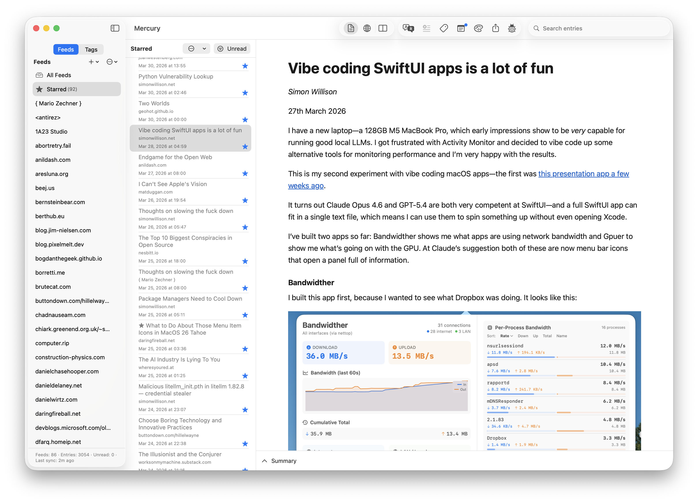
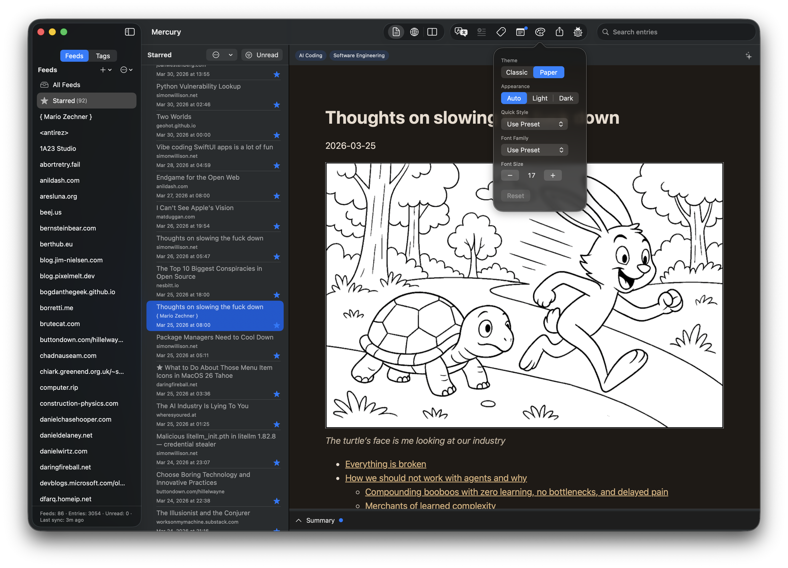
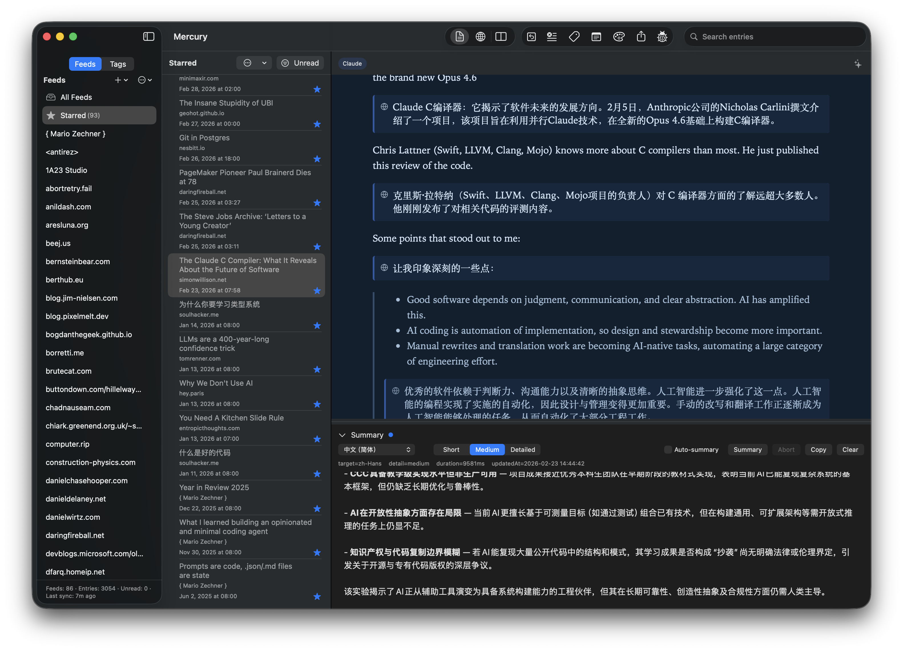
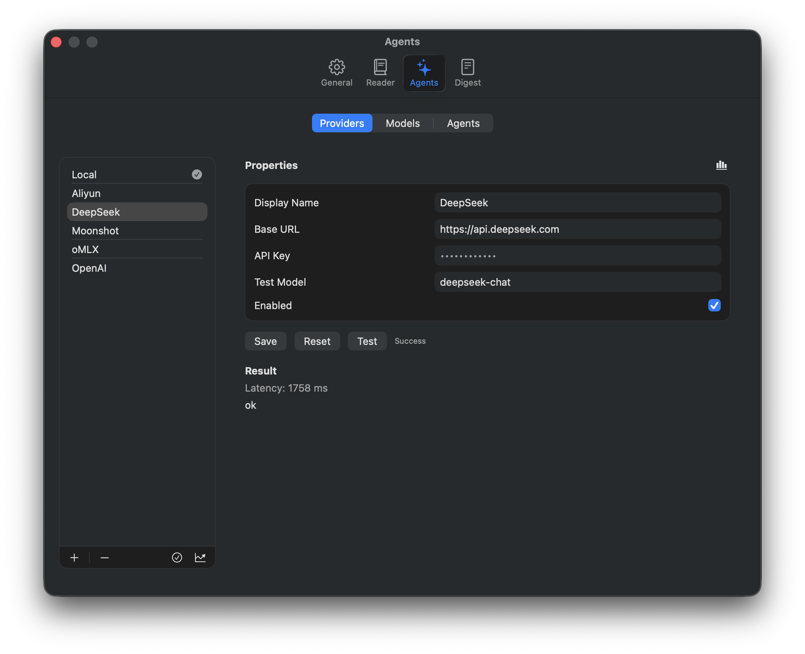
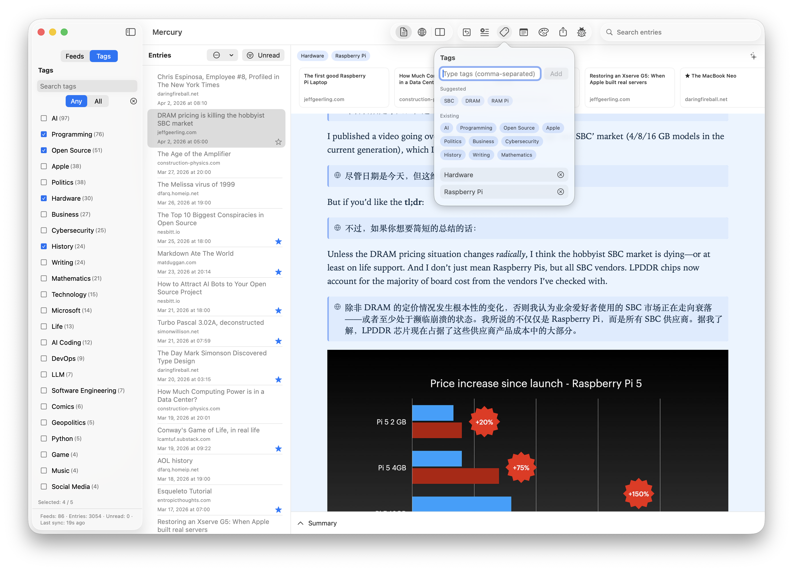
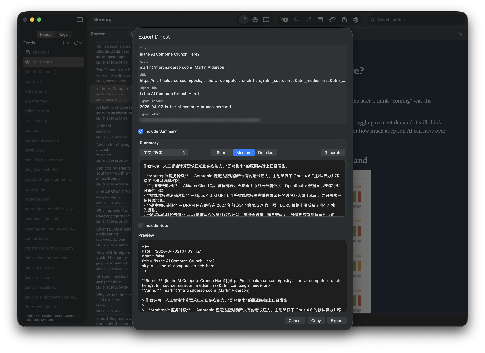

# Mercury

Mercury is a macOS-native, local-first RSS reader focused on comfortable and convenient information aggregation and reading. It boosts your efficiency with highly customizable AI features, entry notes, digest sharing/export, and a tag system, including article summarization, bilingual translation, AI-suggested tags, and batch tagging, powered by any large language model you have access to, whether running locally or as an online service.

Mercury 是一款 macOS 原生、强调本地优先（*local first*）的 RSS 阅读器，专注于方便舒适的信息聚合与阅读体验，并通过高度可定制的 AI 功能、文章笔记、文摘分享与导出，以及标签系统（如文章摘要、双语翻译、AI 推荐标签与批量打标签）提升你的效率，支持任何你能访问的大语言模型，无论本地还是在线服务。

[](https://github.com/neolee/mercury/releases/latest)

[Screens 截图](#screenshots) | [English Readme](#features) | [中文说明](#功能特性)

---

<a id="screenshots"></a>













---

## Features

- **Native macOS experience**: Built with SwiftUI, follows macOS design conventions, supports keyboard-driven workflows
- **Local-first**: No registration, no login, no subscription — Mercury never proactively collects any of your data
- **Multi-format feeds**: Supports RSS, Atom, and JSON Feed; batch import and export via OPML
- **Focused reading**: A clean, distraction-free Reader mode with intelligent content cleaning, customizable themes and fonts, as well as support for tables, images, and list structure
- **Entry notes and digest sharing/export**: Write Markdown notes for each entry, share a plain-text digest through macOS share services, export a single-entry Markdown digest, or export a multi-entry Markdown digest from the current list
- **UI localization**: Interface available in English and Simplified Chinese, switchable at any time without restarting
- **AI Summary**: Generate article summaries with a single click — specify language and detail level, with custom prompts support
- **AI Translation**: Translate articles into your target language, displayed in a bilingual paragraph-by-paragraph layout, with custom prompts support
- **Tag system**: Organize and rediscover articles with manual tags, AI suggestions, and tag-based filtering across feeds
- **Batch tagging and tag library maintenance**: Tag large backlogs in batches, review new tag proposals, merge duplicates, manage aliases, and keep your tag library clean
- **LLM token usage tracking**: Built-in usage statistics and comparison reports for provider/model/agent dimensions
- **Open, privacy-respecting AI integration**: Compatible with any OpenAI-format API, including locally-run and cloud-based services

## Requirements

- macOS 14.6+

To use AI agent features, you also need:

- An OpenAI-compatible API, supporting local or commercial LLM inference services

## Installation

1. Go to the [Releases](https://github.com/neolee/mercury/releases/latest) page and download the latest `.dmg` file
2. Mount the `.dmg` file and drag **Mercury.app** into your Applications folder
3. On first launch, macOS may prompt you about an app downloaded from the internet — click **Open** to proceed (the app is signed with a Developer ID and notarized by Apple)

## Getting Started

### Adding Feeds

- Click the **+** button at the top of the left sidebar, select **Add Feed...**, enter the feed URL, and press Return to add it
- Or select **Import OPML...** and choose your OPML file to import feeds in bulk

### Configuring AI Agents

Mercury's summary, translation, and AI tagging features are powered by AI agents. Before use, you need to configure a large language model provider:

1. Open **Mercury → Settings...** or press **command-,**, then switch to the **Agents** tab
2. Click the **+** button at the bottom of the **Providers** list and fill in:
   - **Display Name**: A name for the provider
   - **Base URL**: The OpenAI-compatible API endpoint, e.g. `https://api.deepseek.com`, or for a local model such as `http://localhost:2233/v1` — include everything before the `chat/completions` path, along with the correct port
   - **API Key**: The credential for the provider (any string works for local models). The key is stored only on your machine, securely in macOS `keychain` — it is never uploaded or shared by Mercury in any form
   - Optionally, enter a model name in **Test Model** and click **Test** to verify the configuration
3. Switch to the **Models** list, click **+** at the bottom, select the provider you just added, enter the model name, and click **Test** to confirm the service responds correctly
4. Switch to the **Agents** list. In the settings pages for **Summary**, **Translation**, and **Tagging**, select the model to use for each, and configure the target language, detail level, or other relevant parameters

### Using the Summary Agent

Open any article, click the **Summary** bar at the bottom of the Reader to expand the summary panel, confirm the target language and detail level, then click **Summary**. The summary will stream in below.

### Using the Translation Agent

With an article open, click the **Translate** button in the main toolbar. The article will be displayed in a bilingual format with original and translated paragraphs paired side by side. If you are not satisfied with the result, click the **Clear** button on the right to discard the translation and try again. Sometimes some segments fail during translation; in that case, click **Retry** in the corresponding segment to retry it.

**Strong recommendation**: Tencent's Hunyuan translation-specialized model [Hy-MT2 1.8B](https://huggingface.co/tencent/Hy-MT2-1.8B-GGUF) is a great fit here. Running it locally as your primary translation model is highly recommended. NOTE: you should set **Prompt Strategy** to **HY-MT Optimized** in **Translation** agent setting if you use this model series.

### Notes and Digest Sharing/Export

With an article open, click **Note** in the Reader toolbar to write your own Markdown note for that entry. Notes are stored locally and can be kept as part of your personal reading workflow even if you do not use any AI features.

You can also create digest output from the same reading context:

- Click **Share Digest...** in the main toolbar to generate a plain-text digest for the current entry and send it through macOS share services
- Click **Export Digest...** in the main toolbar to generate a Markdown digest for the current entry and write it to your configured export folder
- Use **Export Multiple Digest...** from the entry list actions menu to select multiple entries from the current list and export them together as one Markdown digest

These share and export flows always include the original article title, author, and URL. Share Digest can also include your note, while Export Digest and Export Multiple Digest can include the AI summary and your note when available.

### Using Tags

With any article open, click the **#** button in the Reader toolbar to open the tagging panel. You can:

- Enter a tag directly and click **Add**
- Choose suggested tags from **Suggested** and **Existing**
- Switch to the **Tags** view in the sidebar and filter articles by a single tag or a tag combination

If no Tagging agent is configured, **Suggested** shows rough recommendations derived from the article title and summary. If an LLM-based Tagging agent is configured and enabled, this section first shows a loading indicator and then fills in higher-quality AI-generated tag suggestions.

Applied tags appear below the article title and are also used for related-content recommendations and cross-feed filtering.

### Batch Tagging and Tag Library

In **Settings** → **General** → **Tag System**:

- Enable **Enable AI Tagging** to use AI tag suggestions and batch tagging
- Click **Batch Tagging...** to run batch tagging for articles within a selected time range, and review all new tag proposals before applying them so low-quality suggestions do not pollute the tag library
- Click **Tag Library...** to maintain your tag library in one place, including rename, merge, alias management, provisional-tag promotion, and unused-tag cleanup

### Template Customization

The summary, translation, and tagging agents each come with a default set of prompts. In **Settings** → **Agents** → **Agents**, select an agent and click **custom prompts**. Mercury will locate the corresponding *prompts template* — a YAML file — which you can open and edit with any editor. To revert to Mercury's defaults, simply delete your customized file.

Digest output templates can also be customized in **Settings** → **Digest** → **Templates**.

If you want a practical walkthrough for both prompt customization and digest template customization, see our [customization guide](CUSTOM.md).

## Privacy

Mercury follows the local-first principle:

- All feed data, reading state, notes, summaries, and translations are stored in a sandboxed database on your local machine
- No usage data is collected, no information is shared with any third party, no account or login required
- AI requests are handled directly by the API provider you configure. Mercury does not proxy or log any AI request content

## Building from Source

Requirements:
- Xcode 16+, macOS 26 SDK
- Swift Package Manager dependencies are resolved automatically on first build — no additional steps needed

```bash
git clone https://github.com/neolee/mercury.git
cd mercury
./scripts/build
```

## Feedback

If you run into any issues or have feature suggestions, you are welcome to share them:

- **Bug reports / feature requests** — Submit via [GitHub Issues](https://github.com/neolee/mercury/issues). Please include reproduction steps, your macOS version, and your Mercury version where possible
- **AI-related issues** — If summary, translation, or tagging results are not what you expect, customizing prompts (Settings → Agents → Agents → custom prompts) usually helps. For connectivity or configuration problems, use the **Test** button on the settings page to verify model reachability first

## License

This project is released under the [MIT License](LICENSE.md).

---

## 功能特性

- **原生 macOS 体验**：基于 SwiftUI 构建，遵循 macOS 设计规范，支持键盘驱动操作
- **本地优先**：无需注册，无需登录，无需订阅，永远不会主动采集你的任何数据
- **多格式订阅源**：支持 RSS、Atom、JSON Feed；支持 OPML 批量导入与导出
- **专注阅读**：干净清爽的 Reader 模式提供智能化内容清洗、定制化主题与字体，以及对表格、图片和列表结构的良好支持
- **笔记与文摘分享/导出**：可为每篇文章写 Markdown 笔记，并可通过 macOS 分享服务分享纯文本文摘，或导出单篇 Markdown 文摘，或从当前列表导出多篇文章的 Markdown 文摘
- **界面多语言支持**：界面支持英文和简体中文，随时切换，无需重启
- **AI 摘要**：一键生成文章摘要，可指定语言和详细程度，支持自定义 prompts
- **AI 翻译**：将文章翻译为目标语言，原文与译文段落对照显示，支持自定义 prompts
- **标签系统**：支持手动标签、AI 标签建议，以及跨订阅源的按标签筛选与重新发现
- **批量打标签与标签库维护**：可对积压文章进行批量打标签、审查新标签提议、合并重复标签、管理别名，维护干净一致的标签库
- **大语言模型用量统计**：内置 Provider / Model / Agent 维度的统计与对比报表
- **开放、注重隐私的 AI 接入**：兼容任何 OpenAI 格式的 API，包括本地运行和云端运行的各种服务

## 系统要求

- macOS 14.6+

如需使用 AI 智能体功能，还需要：

- 一个兼容 OpenAI 格式的 API 访问方案，支持本地和商业化的大语言模型推理服务

## 安装

1. 前往 [Releases](https://github.com/neolee/mercury/releases/latest) 页面，下载最新的 `.dmg` 文件
2. 挂载下载的 `.dmg` 文件，将 **Mercury.app** 拖入「应用程序」文件夹
3. 首次启动时 macOS 可能提示来自互联网的应用，点击「打开」即可（应用已经过 Developer ID 签名和 Apple 公证）

## 快速上手

### 添加订阅源

- 点击左边栏顶部的 **+** 按钮，选择 **添加订阅源...**，输入订阅源 URL，按回车即可添加
- 或选择 **导入 OPML...** 并选择你的 OPML 文件来批量导入

### 配置 AI 智能体

Mercury 的摘要、翻译与 AI 标签功能都由 AI Agent 驱动，使用前需要配置大语言模型提供者：

1. 打开 **Mercury → 设置...** 或按快捷键 **command-,**，切换到 **智能体** 标签页
2. 点击 **提供者** 列表底部的 **+** 按钮，填写：
   - **显示名称**：提供者的显示名
   - **Base URL**：OpenAI 兼容的 API 入口地址，例如 `https://api.deepseek.com`，或本地模型如 `http://localhost:2233/v1` 等，注意要包含 API `chat/completions` 之前的所有部分，以及正确的端口
   - **API Key**：对应服务提供者的密钥（本地模型可填任意字符串），这个密钥仅在你的机器上保存，使用 macOS 的 `keychain` 服务安全存储，不会被 Mercury 以任何形式上传或共享
   - 可以填写该服务提供者的一个模型名（**测试模型**），然后点击 **测试** 按钮来验证配置无误
3. 切换到 **模型** 列表，点击列表底部的 **+** 按钮，选择刚添加的提供者，填写模型名称，点击 **测试** 按钮验证服务能正常响应
4. 切换到 **智能体** 列表，在 **摘要**、**翻译** 和 **自动标签** 的设置页面中，分别选择各自使用的模型，并设置目标语言、详细程度或其他相关参数

### 使用摘要智能体

打开任意文章，点击阅读区域底部的 **摘要** 条展开摘要窗口，确认目标语言和摘要详细程度，点击 **摘要** 按钮，摘要将在下方流式输出。

### 使用翻译智能体

打开文章后，点击主工具条的 **翻译** 按钮，文章将以原文 / 译文段落对照的双语格式呈现，如果对翻译效果不满意，可以点击右边的 **清除** 按钮清除翻译结果再重新翻译；有时候翻译中会有某些段落失败，这时候可以点对应段落中的 **重试** 来重试。

**特别推荐**：混元的 [Hy-MT2 1.8B](https://huggingface.co/tencent/Hy-MT2-1.8B-GGUF) 翻译专用模型非常适合这里，强烈建议尝试在本地运行该模型作为翻译的主力模型。注意，使用这个系列的翻译模型时，请在翻译智能体设置中将 **提示词策略** 设为 **HY-MT 优化**。

### 使用笔记与文摘分享/导出

打开任意文章后，点击 Reader 工具条中的 **Note**，即可为这篇文章写你自己的 Markdown 笔记。笔记会保存在本地，即使你不使用任何 AI 功能，也可以把它作为个人阅读工作流的一部分。

在同一个阅读上下文里，你还可以生成文摘输出：

- 点击主工具条中的 **分享文摘...**，生成当前文章的纯文本文摘，并通过 macOS 分享服务发送出去
- 点击主工具条中的 **导出文摘...**，为当前文章生成 Markdown 文摘，并写入你配置好的导出文件夹
- 在文章列表的操作菜单中使用 **导出多条文摘...**，先从当前列表中选择多篇文章，再将它们合并导出为一个 Markdown 文摘

这些分享和导出流程都会包含原始文章标题、作者和 URL。分享文摘还可以附带你写的笔记，而导出文摘和导出多条文摘则可以附带 AI 摘要和你的笔记。

### 使用标签

打开任意文章后，点击阅读工具条中的 **#** 按钮即可打开标签面板。你可以：

- 直接输入标签并点击 **添加** 添加
- 从 **推荐标签** 和 **现有标签** 中选择建议标签
- 在左边栏切换到 **标签** 视图，按单个标签或标签组合筛选文章

如果没有配置自动标签智能体，**推荐标签** 中会显示基于文章标题和摘要提取的粗略推荐；如果已经配置并启用了基于 LLM 的自动标签智能体，这里会先显示加载动画，随后补充更高质量的 AI 推荐标签。

已应用的标签会显示在文章标题下方，也会参与相关文章推荐与跨订阅源筛选。

### 批量打标签与标签库

在 **设置** → **通用** → **标签系统** 中：

- 启用 **启用 AI 打标签** 后，可使用 AI 标签推荐与批量打标签
- 点击 **批量打标签...** 可对一段时间范围内的文章执行批量打标签，并在实际采用 AI 建议前对所有新标签进行审查，以避免不好的标签推荐污染标签库
- 点击 **标签库...** 可集中维护标签库，包括重命名、合并、别名管理、临时标签提升与未使用标签清理

### 模板自定义

摘要、翻译和自动标签智能体各有一套默认 prompts，可在 **设置** → **智能体** → **智能体** 中选择某个智能体，然后点击 **自定义提示词**，Mercury 会定位到对应的提示词模板，这是一个 YAML 格式的文件，你可以用你选择的编辑器打开它进行定制。如果你想放弃你的定制，仍使用 Mercury 默认的 prompts，直接删除你定制的文件即可。

文摘输出模板也可以在 **设置** → **文摘** → **模板定制** 中进行定制。

如果你希望了解提示词定制和文摘模板定制的具体方式，可参考我们的[定制指南](CUSTOM.md)。

## 隐私

Mercury 遵循本地优先原则：

- 所有订阅数据、阅读状态、笔记、摘要和翻译结果均存储在你本机的沙盒数据库中
- 不收集任何使用数据，不与任何第三方共享信息，不需要账号，不需要登录
- AI 请求由你配置的 API 提供者直接处理，Mercury 本身不代理、不记录任何 AI 请求内容

## 从源码构建

要求：
- Xcode 16+，macOS 26 SDK
- Swift Package Manager 依赖会在首次构建时自动解析，无需额外操作

```bash
git clone https://github.com/neolee/mercury.git
cd mercury
./scripts/build
```

## 问题反馈

如果你在使用中遇到问题，或有功能建议，欢迎通过以下方式反馈：

- **Bug 报告 / 功能建议** — 在 [GitHub Issues](https://github.com/neolee/mercury/issues) 提交，请尽量描述复现步骤、macOS 版本和 Mercury 版本
- **AI 相关问题** — 如果摘要、翻译或自动标签结果不符合预期，通常可以通过定制 prompts（设置 → 智能体 → 智能体 → 自定义提示词）改善；如果是连接或配置问题，请先用设置页面的 **测试** 按钮验证模型可达性

## 许可证

本项目基于 [MIT License](LICENSE.md) 发布。
